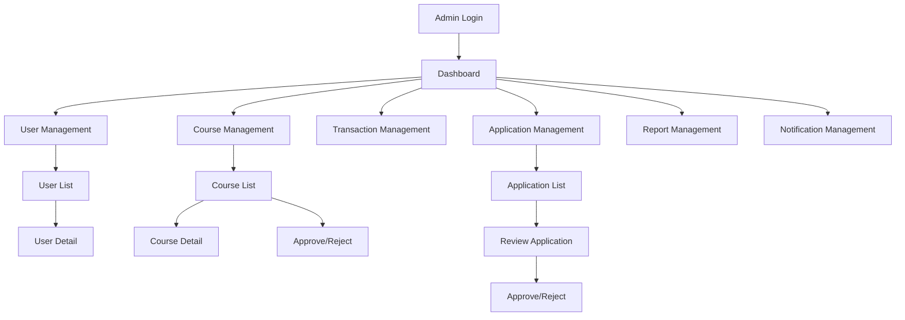

# Tài liệu Yêu cầu Sản phẩm - Admin Dashboard

## 1. Tổng quan Sản phẩm

Admin Dashboard là hệ thống quản trị tập trung cho nền tảng học tiếng Anh SkillBoost, cho phép quản trị viên giám sát và quản lý toàn bộ hoạt động của hệ thống. Dashboard cung cấp giao diện trực quan để quản lý người dùng, khóa học, giao dịch, báo cáo và các chức năng quản trị khác.

Sản phẩm giải quyết nhu cầu quản lý tập trung cho hệ thống có 3 vai trò chính: User (học viên), Course Seller (người bán khóa học), và Administrator (quản trị viên).

## 2. Tính năng Cốt lõi

### 2.1 Vai trò Người dùng

| Vai trò | Phương thức Đăng ký | Quyền Cốt lõi |
|---------|---------------------|---------------|
| Administrator | Được cấp quyền bởi hệ thống | Toàn quyền quản lý hệ thống, xem báo cáo, quản lý người dùng |

### 2.2 Module Tính năng

Hệ thống Admin Dashboard bao gồm các trang chính sau:

1. **Dashboard Tổng quan**: Thống kê tổng quan, biểu đồ doanh thu, số liệu người dùng
2. **Quản lý Người dùng**: Danh sách, thông tin chi tiết, phân quyền người dùng
3. **Quản lý Khóa học**: Duyệt khóa học, quản lý trạng thái, thống kê
4. **Quản lý Giao dịch**: Theo dõi thanh toán, nạp tiền, rút tiền
5. **Quản lý Đơn đăng ký**: Xử lý đơn đăng ký Course Seller
6. **Quản lý Báo cáo**: Xử lý báo cáo vi phạm từ người dùng
7. **Quản lý Thông báo**: Gửi thông báo hệ thống
8. **Quản lý Gói đăng ký**: Cấu hình subscription plans
9. **Quản lý Bài kiểm tra**: Quản lý test types và score conversions

### 2.3 Chi tiết Trang

| Tên Trang | Tên Module | Mô tả Tính năng |
|-----------|------------|-----------------|
| Dashboard | Thống kê tổng quan | Hiển thị biểu đồ doanh thu, số lượng người dùng, khóa học, giao dịch. Widget thống kê nhanh |
| Quản lý Người dùng | Danh sách người dùng | Xem, tìm kiếm, lọc người dùng theo role. Xem chi tiết profile, wallet, hoạt động |
| Quản lý Người dùng | Chi tiết người dùng | Xem thông tin đầy đủ, lịch sử giao dịch, khóa học đã mua, báo cáo |
| Quản lý Khóa học | Danh sách khóa học | Xem tất cả khóa học, lọc theo trạng thái, duyệt/từ chối khóa học |
| Quản lý Khóa học | Chi tiết khóa học | Xem nội dung khóa học, lessons, ratings, reports |
| Quản lý Giao dịch | Danh sách giao dịch | Xem tất cả transactions, topup orders, theo dõi trạng thái |
| Quản lý Đơn đăng ký | Đơn Course Seller | Duyệt/từ chối đơn đăng ký, xem certification, expertise |
| Quản lý Báo cáo | Danh sách báo cáo | Xử lý reports từ người dùng, phân loại theo lý do |
| Quản lý Thông báo | Hệ thống thông báo | Tạo và gửi notifications, quản lý notification types |
| Quản lý Gói đăng ký | Subscription Plans | CRUD subscription plans, xem contracts |

## 3. Quy trình Cốt lõi

Quy trình chính của Admin:

1. **Đăng nhập** → Dashboard tổng quan
2. **Quản lý người dùng** → Xem danh sách → Chi tiết người dùng → Thực hiện hành động
3. **Duyệt khóa học** → Danh sách khóa học pending → Xem chi tiết → Approve/Reject
4. **Xử lý đơn đăng ký** → Danh sách applications → Xem thông tin → Approve/Reject
5. **Xử lý báo cáo** → Danh sách reports → Điều tra → Thực hiện hành động

## 4. Thiết kế Giao diện Người dùng

### 4.1 Phong cách Thiết kế

- **Màu sắc chính**: Primary (#3B82F6), Secondary (#10B981), Accent (#F59E0B)
- **Kiểu nút**: Rounded corners, gradient backgrounds cho primary actions
- **Font**: Poppins cho headings, Inter cho body text
- **Layout**: Sidebar navigation, card-based content, top navigation bar
- **Icons**: Lucide React icons, consistent với theme hiện tại

### 4.2 Tổng quan Thiết kế Trang

| Tên Trang | Tên Module | Các Thành phần UI |
|-----------|------------|-------------------|
| Dashboard | Thống kê tổng quan | Cards với số liệu, Charts (Line, Bar, Pie), Recent activities table |
| User Management | Danh sách người dùng | Data table với search, filters, pagination, action buttons |
| User Detail | Chi tiết người dùng | Profile card, tabs (Info, Wallet, Courses, Activities), action buttons |
| Course Management | Danh sách khóa học | Data table, status badges, filter dropdowns, bulk actions |
| Course Detail | Chi tiết khóa học | Course info card, lessons list, ratings, approval buttons |
| Applications | Đơn đăng ký | Cards layout, status indicators, review modal, action buttons |
| Reports | Báo cáo vi phạm | Table với priority indicators, category filters, action dropdown |
| Transactions | Giao dịch | Table với amount formatting, status badges, date filters |

### 4.3 Responsive Design

Thiết kế responsive với mobile-first approach:
- Desktop: Full sidebar navigation, multi-column layouts
- Tablet: Collapsible sidebar, adapted card layouts  
- Mobile: Bottom navigation, single column, touch-optimized controls