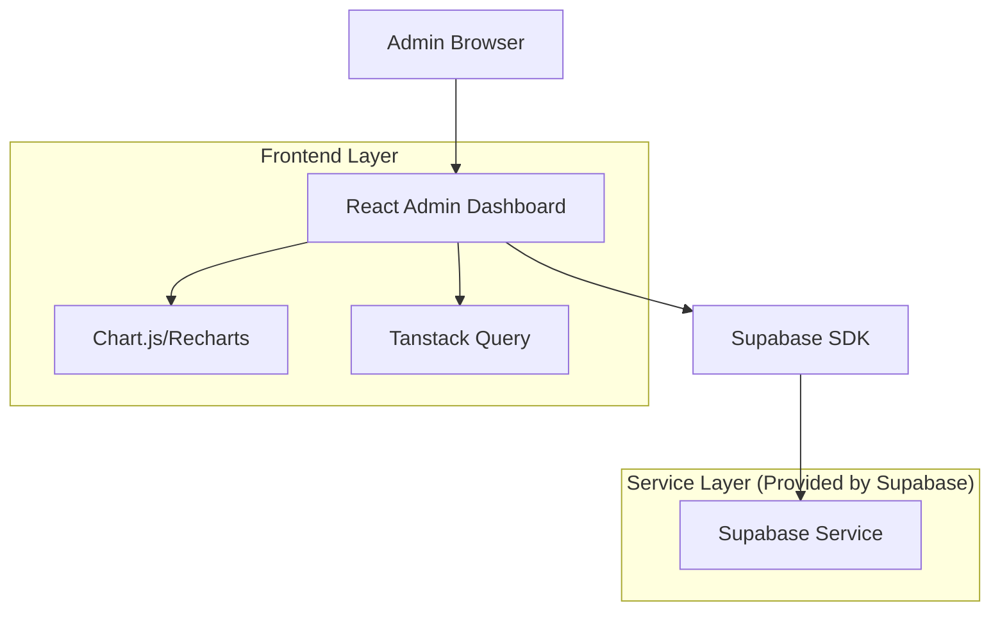
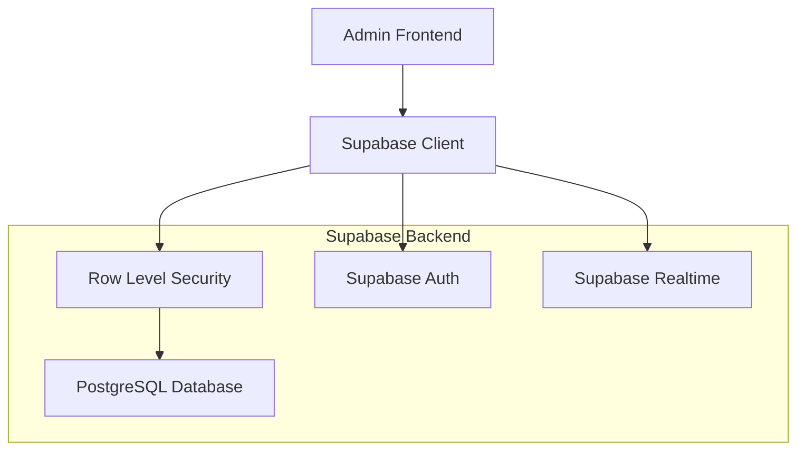
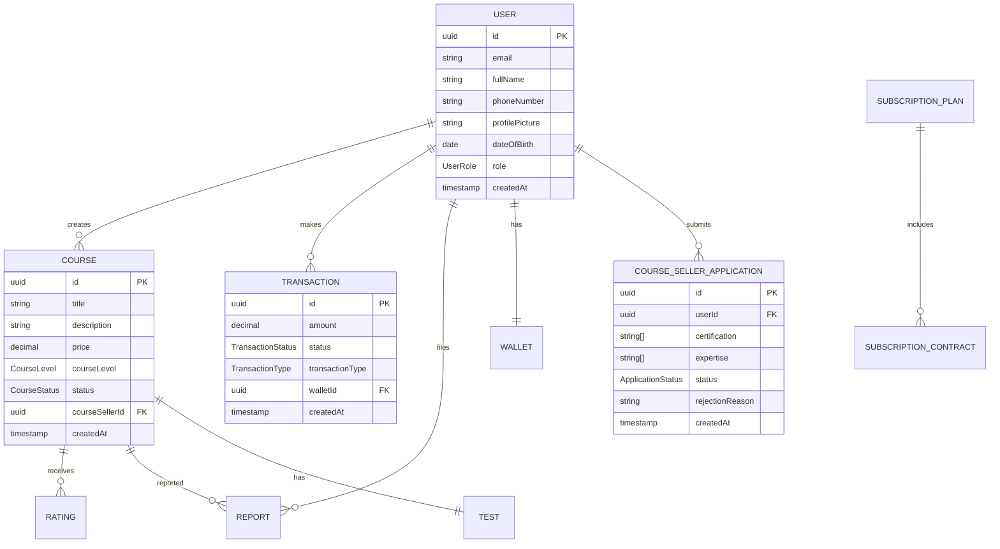

# Tài liệu Kiến trúc Kỹ thuật - Admin Dashboard

## 1. Thiết kế Kiến trúc



## 2. Mô tả Công nghệ

* Frontend: React\@18 + TypeScript + Tailwind CSS + Vite

* UI Components: shadcn/ui components

* State Management: Tanstack Query cho server state

* Charts: Recharts cho data visualization

* Backend: Supabase (Authentication + Database + Real-time)

* Database: PostgreSQL (via Supabase)

## 3. Định nghĩa Route

| Route                     | Mục đích                               |
| ------------------------- | -------------------------------------- |
| /admin                    | Admin dashboard tổng quan với thống kê |
| /admin/users              | Quản lý danh sách người dùng           |
| /admin/users/:id          | Chi tiết thông tin người dùng cụ thể   |
| /admin/courses            | Quản lý danh sách khóa học             |
| /admin/courses/:id        | Chi tiết khóa học và duyệt nội dung    |
| /admin/transactions       | Quản lý giao dịch và thanh toán        |
| /admin/applications       | Xử lý đơn đăng ký Course Seller        |
| /admin/reports            | Quản lý báo cáo vi phạm                |
| /admin/notifications      | Quản lý hệ thống thông báo             |
| /admin/subscription-plans | Quản lý gói đăng ký                    |
| /admin/tests              | Quản lý bài kiểm tra và loại test      |

## 4. Định nghĩa API

### 4.1 Core API

**Quản lý người dùng**

```
GET /api/admin/users
```

Request:

| Tên Param | Loại Param | Bắt buộc | Mô tả                             |
| --------- | ---------- | -------- | --------------------------------- |
| page      | number     | false    | Số trang (mặc định: 1)            |
| limit     | number     | false    | Số lượng mỗi trang (mặc định: 20) |
| role      | UserRole   | false    | Lọc theo vai trò                  |
| search    | string     | false    | Tìm kiếm theo tên/email           |

Response:

| Tên Param | Loại Param | Mô tả                |
| --------- | ---------- | -------------------- |
| users     | User\[]    | Danh sách người dùng |
| total     | number     | Tổng số người dùng   |
| page      | number     | Trang hiện tại       |

**Quản lý khóa học**

```
GET /api/admin/courses
PUT /api/admin/courses/:id/status
```

Request (PUT):

| Tên Param | Loại Param   | Bắt buộc | Mô tả                          |
| --------- | ------------ | -------- | ------------------------------ |
| status    | CourseStatus | true     | Trạng thái mới (ACTIVE/REFUSE) |
| reason    | string       | false    | Lý do từ chối (nếu REFUSE)     |

**Quản lý đơn đăng ký**

```
GET /api/admin/applications
PUT /api/admin/applications/:id
```

Request (PUT):

| Tên Param       | Loại Param        | Bắt buộc | Mô tả                  |
| --------------- | ----------------- | -------- | ---------------------- |
| status          | ApplicationStatus | true     | APPROVED hoặc REJECTED |
| rejectionReason | string            | false    | Lý do từ chối          |

Example:

```json
{
  "status": "APPROVED"
}
```

## 5. Sơ đồ Kiến trúc Server



## 6. Mô hình Dữ liệu

### 6.1 Định nghĩa Mô hình Dữ liệu



### 6.2 Data Definition Language

**Bảng Users (users)**

```sql
-- Đã có sẵn trong schema.prisma
-- Cần thêm RLS policies cho admin access

-- Grant permissions cho admin role
GRANT SELECT, UPDATE ON users TO authenticated;

-- RLS Policy cho admin
CREATE POLICY "Admin can view all users" ON users
  FOR SELECT USING (
    EXISTS (
      SELECT 1 FROM administrator_profiles 
      WHERE user_id = auth.uid()
    )
  );

CREATE POLICY "Admin can update user status" ON users
  FOR UPDATE USING (
    EXISTS (
      SELECT 1 FROM administrator_profiles 
      WHERE user_id = auth.uid()
    )
  );
```

**Bảng Courses (courses)**

```sql
-- Grant permissions cho admin
GRANT SELECT, UPDATE ON courses TO authenticated;

-- RLS Policy cho admin quản lý courses
CREATE POLICY "Admin can manage all courses" ON courses
  FOR ALL USING (
    EXISTS (
      SELECT 1 FROM administrator_profiles 
      WHERE user_id = auth.uid()
    )
  );
```

**Bảng Course Seller Applications (course\_seller\_applications)**

```sql
-- Grant permissions
GRANT SELECT, UPDATE ON course_seller_applications TO authenticated;

-- RLS Policy
CREATE POLICY "Admin can manage applications" ON course_seller_applications
  FOR ALL USING (
    EXISTS (
      SELECT 1 FROM administrator_profiles 
      WHERE user_id = auth.uid()
    )
  );
```

**Bảng Transactions (transactions)**

```sql
-- Grant permissions
GRANT SELECT ON transactions TO authenticated;

-- RLS Policy
CREATE POLICY "Admin can view all transactions" ON transactions
  FOR SELECT USING (
    EXISTS (
      SELECT 1 FROM administrator_profiles 
      WHERE user_id = auth.uid()
    )
  );
```

**Bảng Reports (reports)**

```sql
-- Grant permissions
GRANT SELECT, UPDATE ON reports TO authenticated;

-- RLS Policy
CREATE POLICY "Admin can manage reports" ON reports
  FOR ALL USING (
    EXISTS (
      SELECT 1 FROM administrator_profiles 
      WHERE user_id = auth.uid()
    )
  );
```

